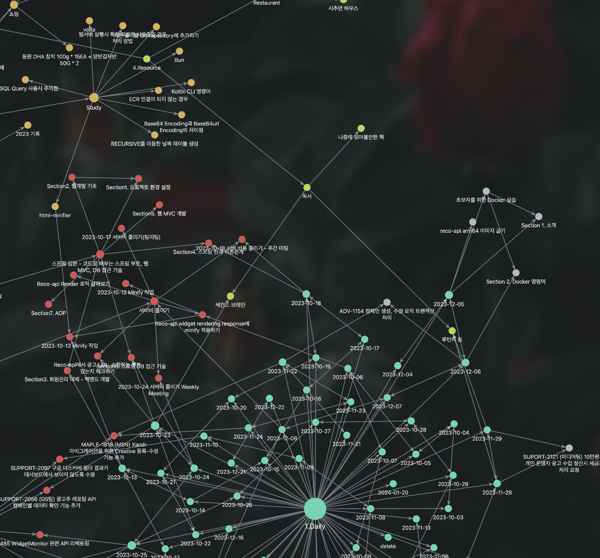

길었던 휴가가 이제 딱 2일 남았다.  😢 지난 1월 5일부터 해서 21일까지 WD 기준으로 10일 동안 휴가를 사용해서 2024년을 2주간의 휴가로 시작하게 되었다.

휴가를 쓰면서 이번 휴가에는 여행이나 공부와 같은 계획은 하지도 않았고, 그냥 무작정 쉬고 싶었다. 그냥 쉬면서 아이들과 조금 더 시간을 쓰고 나의 커리어에 대해서 약간의 생각을 해보고자 하였다. 그런데 휴가의 90%가 지난 오늘 생각하니 약간 아쉽기도 하고, 조금 쉬어 봤더니 더 쉬고 싶다는 생각이 강렬하게 들고 있는 상황이다. 🙏

어쨋든 휴가가 3일 정도 지난 시점에서 이러면 안되는데 라는 시간이 스물스물 들기 시작했고, 관련해서 몇가지 목표를 정했다.

1. 📝 블로그 정리하기
2. 🗒️ 메모툴 정리하기
3. ✍️ 어떤 강의든 개발 관련 강의 1개 완강하기

사실 이것 말고도 친구, 친척 만나기 등의 목표도 세우긴 했는데, 블로그에 쓰긴 뭐해서 이런 것들을 제외하고 자기 계발 관점에서 세운 목표는 딱 3개였다. 이 목표로 했던것들은 어떻게 되었는지 간단하게 회고를 해보고자 한다.

### 📝 블로그 정리하기

일단 블로그 정리는 이전에도 계속 시도는 하고 있었다. 기존 블로그 도메인(three-snakes.com)을 연장하는 것을 깜빡 잊었더니 도메인을 빼앗겨 버리고 😢 [티스토리 블로그](https://three-snakes.tistory.com/)로 한번 이전했었다. 그런데 이상하게 티스토리 블로그는 손이 가지 않았고 그렇게 손을 놓게 되어 버렸는데 이번 휴가 때 블로그를 다시 살려보자는 목표를 세웠고 지금 이 글이 올라가는 블로그가 결과물이다.

일단 기존에 사용하던 [gatsby-starter-lumen](https://github.com/alxshelepenok/gatsby-starter-lumen) 테마를 이용해서 다시 만들었고 기존 도메인을 사기에는 살짝 부담되서 [threesnakes.net](http://threesnakes.net) 도메인을 구매했다. 네이버, 구글 검색 연동 및 google 애널리틱스도 연동, 댓글 기능도 연동 완료 했다. 기존 블로그에 있던 글도 사실 복붙만 하면 migration이 완료되기는 한데.. 아직도 고민중이긴 한데.. 🤔 대부분의 포스트들이 궂이 옮길 필요가 있나? 싶은 내용들이라 그냥 내비둘까 싶다.

여튼 블로그 정리하기는 이번 휴가 때 잘 끝낸것 같다.!

### 🗒️ 메모툴 정리하기

기존에는 메모툴로 옵시디안 노트를 사용하고 있었다. 여러 플러그인을 사용해서 나름 내 입맛대로 설정하고 조금 빡세게 사용했다. 데일리 노트, 각종 문서등을 저장하는 개인 메모앱으로 열심하 사용했다.

그런데 옵시디언 노트가 다음 2가지가 너무 불편 했다.

- 모바일에서 사용성이 너무 떨어졌다.
  - 일단 내가 플러그인을 많이 설치하긴 했는데.. 이 때문에 나의 낡은 📱 se2에서는 앱을 구동 시키는 것도 힘들어 했다. 조금 더 좋은 핸드폰이었다면 괜찬았겠지만.. 😢
- 캘린더 연동이 안됨.
  - 물론 모든 캘린더가 연동이 안되는게 아니라 구글 캘린더의 경우 ICS 플러그인을 통해서 당일 캘린더 내용을 불러올 수 있었다. 그런데 주로 사용하는 icloud 연동이 안되는게 너무 컸다. 바꾸면 되지 않냐? 라고 할 수 있는데 그렇게 하자니 와이프의 공용 캘린더도 바꿔야 하는등의 문제가 발생했다. 결국 일정은 구글 캘린더 그대로 사용했다.

결국 위 2가지 문제 때문에 노션으로 옮겨 가게 되었고 현재는 노션에 모든 문서를 이관 완료✅ 하였다. 또 마침 어제 노션 캘린더라는 새로운 기능이 생겼는데, 이게 또 와이프와 내가 원하던 기능이여서 옮겨가길 잘하게 된것 같다.

### ✍️ 어떤 강의든 개발 관련 강의 1개 완강하기

강의 같은 경우 처음에는 CKAD 자격증 취득 하고자 작년에 구매했던 강의를 들으려 했는데, 생각해보니 내가 Docker와 Container에 대한 개념도 제대로 잡혀있지 않은것 같아서 일단 Docker 강의를 듣기 시작했다.

이번에 들은 강의는 [【한글자막】 초보자를 위한 Docker 실습 - 데브옵스 (DevOps)](https://www.udemy.com/course/docker-hands-on-devops/)라는 4.5시간 짜리 짧은 강의였는데 꽤 만족하면서 들었다. 강의 시간은 짧았지만 실습을 제공해서 하나씩 실습하니 꽤 시간이 걸렸다. 별도의 실습을 할 수 있다는 플랫폼을 제공하는 점에서 이 강의에 사용한 비용히 전혀 아깝지 않았고 번역도 꽤 괜찮았다. 누군가 Docker 강의 추천을 부탁한다면 자신있게 추천할 수 있는 강의였다.

### ☺️ 정리

이 글을 쓰기 전까지는 내가 마냥 논것 같았는데, 그래도 마냥 놀지는 않았구나~ 라는 생각이 조금 들었다. 😄 물론 갓생을 살았다고는 말은 못하지만 애들이 휴가기간 내내 아파서 병원 다녀오고, 학원 등원 시키고, 집 정리 한거에 비하면 나름 많이 한것 같다. ( 근데 또 이렇게 생각하니.. 잘 쉰것 같지는 않은것 같고.. 😢 )

이제 휴가는 내일이면 끝나지만 끝나가는 휴가가 아쉽지만 남은 시간이라도 더 놀기 위해서 일단 이번 글은 여기서 정리해야겠다. 이제 놀자. 🎢
